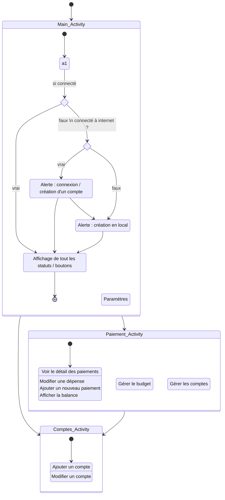
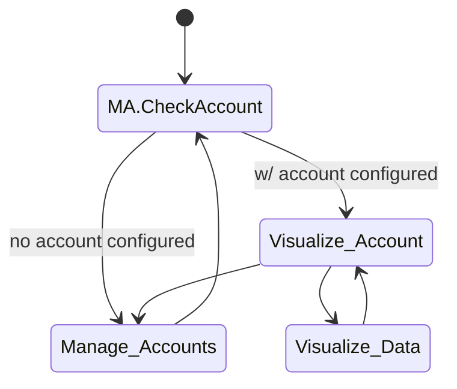

# MyWallet

Application android de gestion de budget.

## Cahier des charges :
> Tout ce que l'app devra pouvoir faire

### Objectif
L'application répond au besoin de suivre les évolutions de ses finances en permettant à un groupe de personne d'affecter des dépenses à des enveloppes (compte) de dépenses. */===== ...les évolutions passées et avenir ? =====/*

### Définitions
> Cette section donne quelques définitions générales utiles à la compréhension des autres sections.

 Une *__dépense__* est définie par:
 - Une catégorie ou un budget: *décrivant le type de dépense comme restaurant ou maison, faisant référence à un budget dans le compte*
 - Un compte: *la dépense est directement affecté à un compte, elle n'existe pas sans cette information*
 - Une personne: *La personne qui paye*
 - Une date
 - Un montant en euros

 Une *__recette__* est défini de la même manière qu'une dépense.

 Un *__budget__* est défini par:
 - Un nombre et un volume de dépenses en euros
 - Une durée: *sur quelle période le budget est valable*
 - Une cyclicité: *certains budgets ne sont valablee qu'une seule fois (travaux) mais d'autres peuvent simplement être remis à 0 tous les mois (budget bouffe)*
 - Une date de début: *Un jour d'un mois, cette date servira de référence pour les budgets cycliques.*
 - Un statut: *taux d'imputation du budget en % et en euros(volume total)*

 Un *__compte__* est défini par:
 - Un nombre de dépense (liste unitaire)
 - Une liste de participants (différents utilisateur)
 - Une dette entre utilisateur (donne l'écart en volume de dépense entre deux utilisateur du compte)
 
 
 Un *__investissement__* est défini par:
 *Il s'agit d'un achat futur, définissable sur plusieurs période de temps en amont, permettant ainsi de l'étaler sur plusieurs période d'un même budget*
 > Hérite d'une dépense ; la date est celle de l'achat prévisionnel, au moment du paiement.
 - Une période de temps: *période de paiement*
 - Un nombre de paiement: *le nombre de fois qu'il sera en partie payé*
 - Un statut: *état du paiement ; si payé ou pas ; si en parti payé*
 *=/==== cet objet ne prend pas en compte la possibilité d'un paiement irrégulier sur des dates irrégulières ====/=*
 

### Gestion des comptes de dépenses
> Cette section détaille la façons dont doivent être gérée les dépenses.

*Les cases sont à cochées lorsqu'on aura couvert la fonctionalité.*
- [ ] 1.1 L'utilisateur doit pouvoir saisir/supprimer une dépense ou une recette.
      Lorsque l'utilisateur supprime un budget, les dépenses associées sont conservés (sans attribution).
- [ ] 1.2 L'utilisateur doit pouvoir ajouter une dépense ou une recette d'une manière très rapide.
- [ ] 1.3 L'utilisateur doit pouvoir modifier une dépense ou une recette existante (tout est ouvert).
- [ ] 1.4 L'utilisateur doit pouvoir affecter la personne émettant la dépense ou une recette. 
          (note: il s'agit uniquement d'un flag, lorsqu'on rejoint un compte on crée soit une nouvelle personne soit on indique qui l'on est (appli locale par rapport à la configuration du compte).
- [ ] 1.12 L'application doit permettre de segmenter une dépense en plusieurs sous dépenses pour affecter les sous-dépenses à différentes enveloppes budgétaires. Ceci permettrait d'une part de faire le lien avec la dépense dans le compte en banque de l'utilisateur mais également de ne pas s'y limiter, car dans nos courses chacun peut aller prendre des éléments pour la maison mais également de la bouffe.
- [ ] 1.5 L'utilisateur doit pouvoir créer/supprimer un compte ou un budget. *ou un sous-budget ?*
      Lorsque l'utilisateur supprime un compte: les budgets et dépenses associées sont soit supprimés soit archivés.
- [ ] 1.6 L'utilisateur doit pouvoir ajouter / supprimer des participants à un compte. Ce faisant toutes les dépenses effectuées par celui-ci sont supprimés.
- [ ] 1.7 L'application doit permettre à l'utilisateur de définir le profil utilisateur par défaut pour chaque compte (gain de temps lors de la saisie, la possibilité d'affecter une dépense au titre de quelqu'un d'autre est toujours possible).
- [ ] 1.8 L'application doit permettre de changer qui est le profil d'utilisateur par défaut sur chaque compte pour chaque appareil connecté au compte.
          C'est à dire que lorsqu'on rejoint un compte on puisse indiquer à l'application qui cet appareil représente, permettant de pré-assigner la dépense ou la recette.
- [ ] 1.9 L'application doit pouvoir fournir des graphiques sur l'usage du compte : consommation sur le budget par catégorie ; dépassement global du budget sur plusieurs période (en fct du budget) ; sur plusieurs projet long termes, voir le temps d'aboutissement ; analyses multi-comptes ou mono-compte ; *etc*
      *à définir plus précisemment - quelles informations on veut avoir là dessus*
- [ ] 1.10 L'utilisateur doit pouvoir créer/supprimer/modifier un investissement.
- [ ] 1.11 L'application doit demander à un utilisateur si l'investissement a été réalisé.

### Export
> Cette section détailles les spécifications liés à l'export des données et les compatibilités avec des logiciels tiers.

- [ ] 2.1 L'application doit fournir un moyen d'exporter l'état d'un compte en CSV:
      Sur une période donnée ou depuis le début.
      Doit également contenir le détail des enveloppes de budget.

### Connectivité
> Cette section détaille le contenu des spécifications concernant la gestion de la synchronisation.

- [ ] 3.1 L'application doit pouvoir fonctionner avec et sans configuration serveur de synchronisation.
- [ ] 3.2 L'application doit fournir un moyen de synchronisation des données entre tous les utilisateurs d'un même compte.
- [ ] 3.3 La synchronisation n'est pas obligatoire et ne se fera que lorsqu'une connexion Wifi est disponible.
- [ ] 3.4 L'application doit pouvoir fournir un moyen de configurer un serveur pour l'application:
      - Adresse IP, Port, etc...
- [ ] 3.5 L'application doit permettre à différents utilisateurs de se connecter au même compte sans avoir à recréer un compte localement.
- [ ] 3.6 Lorsque deux utilisateurs cherchent à synchroniser les différents comptes, une résolution de conflits peut avoir lieu. Dans ce cas la modification la plus récente est préférrée. L'application doit indiquer qu'un conflit a eu lieu sur la dépense.

## Phase de dev :
> Quel élément on développe quand

Partie basique : 1.1 ; 1.2 ; 1.3 ; 1.4 ; 1.5 ; 1.6
Partie intermédiraire : 1. ; 2.1 ?
Partie préfinale : 1. ; 2. ; 3.

A faire et à remplir ici: https://trello.com/b/iHcPBIoF/mywallet
@Max => faut que tu crées un compte :). (le lien il marche pas xD)
On fera du Kanban, on s'emmerde pas mais juste on tient à jour le statut histoire qu'on se perde pas. ouai jpense c'est pas mal pcq  sinon c bourbier ahah

## Structure de l'application :

### Activités :
> définition de chaque activité, de leur fonctionnement interne et externe / intéraction entre elles et avec l'extérieur / affectation à quelle étape du projet

1. Accueil et visualisation dépenses et budget
   Ajout/Modification d'une dépense à un compte existant
2. Ajout/Modification d'un compte
   Liste des comptes
3. Configuration Appli
4. Export données
5. Visualisation données du compte

Hors ; - Widget : Ajout d'une dépense ou d'une recette et vu partielle de la balance ou d'un budget choisi, le tout pour un compte
       - QuickSetting : Ajout d'une dépense ou d'une recette

### Diagramme :

#### Fonctionnement global

https://mermaid-js.github.io/mermaid/#/stateDiagram?id=states
https://mermaid.live/

#### Diagramme précis : UML

## Autres idées :

# Commentaire :

Max : J'ai fait un draft, je sais pas si j'ai +/- tout rassemblé niveau cdc ?
Voilàà xD

Alex : => J'ai repris ta proposition en consolidant un peu le truc et en précisant certains choses :). Les notions de court, moyen, long terme je suis pas fan parce que chaque budget a sa durée propre donc c'est difficile de concilier ça de façons "générique". Je te laisserai annoter / supprimer ce qui te plaît ou non!

Max : J'ai rajouté quelques trucs, n'hésite pas si c'est flou ou l'inverse. J'ai rajouté un diagramme/début de en gros comment pourrait s'agencer tout ça :) | Effectivement court-moyen-long terme c'est pas précis xD. J'avoue le cahier des charges comme ça c'est beaucoup plus clair eheh xD.

Max : J'ai rajouté un plan de sous-catégorie en plus pour que ce soit plus simple à ranger

# Ressources :
> Les sites pour savoir comment coder différentes fonctionnalités de l'appli ou pour le projet fin bref voila un truc de ressource quoi xD

Pour faire un quicksetting (réglage icon en haut du volet déroulant) : https://developer.android.com/develop/ui/views/quicksettings-tiles
Ajouter un id dans un menu de config (style 3 points verticaux) : https://stackoverflow.com/questions/13784088/setting-popupmenu-menu-items-programmatically
Faire un input dans une notification : https://stackoverflow.com/questions/43983505/android-notification-user-input
Exporter en .csv en java : https://www.baeldung.com/java-csv

Tutoriels mise en place navigation entre activité: 
 https://www.answertopia.com/jetpack-compose/a-jetpack-compose-navigation-tutorial/ (Comprendre l'usage du NavHostController)
 https://developer.android.com/guide/navigation/navigation-getting-started#kts

ViewModels in Android:
(Le but: avoir une abstraction entre l'UI et la donnée de contexte liée au live. Cette abstraction fera office d'interface vers la DB permettant de conserver une vue "plus réactive")
 https://developer.android.com/topic/libraries/architecture/viewmodel
 
