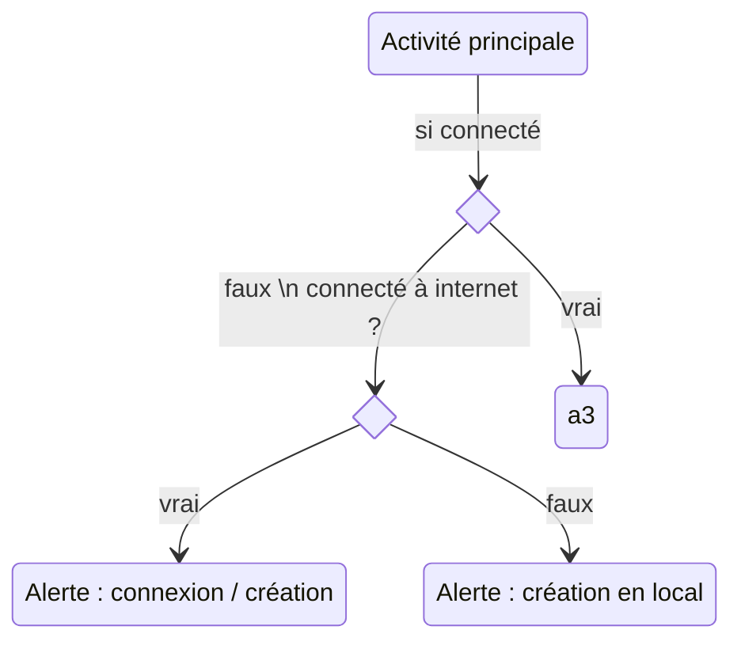

# MyWallet

Application android de gestion de budget.

## Cahier des charges :
> Tout ce que l'app devra pouvoir faire

### Objectif
L'application répond au besoin de suivre les évolutions de ses finances en permettant à un groupe de personne d'affecter des dépenses à des enveloppes (compte) de dépenses.

### Définitions
> Cette section donne quelques définitions générales utiles à la compréhension des autres sections.

 Une *__dépense__* est définie par:
 - Une catégorie ou un budget: *décrivant le type de dépense comme restaurant ou maison, faisant référence à un budget dans le compte*
 - Un compte: *la dépense est directement affecté à un compte, elle n'existe pas sans cette information*
 - Une personne: *La personne qui paye*
 - Une date
 - Un montant en euros

 Un *__budget__* est défini par:
 - Un nombre et un volume de dépenses en euros
 - Une durée: *sur quelle période le budget est valable*
 - Une cyclicité: *certains budgets ne sont valablee qu'une seule fois (travaux) mais d'autres peuvent simplement être remis à 0 tous les mois (budget bouffe)*
 - Une date de début: *Un jour d'un mois, cette date servira de référence pour les budgets cycliques.*
 - Un statut: *taux d'imputation du budget en % et en euros(volume total)*

 Un *__compte__* est défini par:
 - Un nombre de dépense (liste unitaire)
 - Une liste de participants (différents utilisateur)
 - Une dette entre utilisateur (donne l'écart en volume de dépense entre deux utilisateur du compte)

### Gestion des comptes de dépenses
> Cette section détaille la façons dont doivent être gérée les dépenses.

*Les cases sont à cochées lorsqu'on aura couvert la fonctionalité.*
- [ ] L'utilisateur doit pouvoir saisir/supprimer une dépense.
      Lorsque l'utilisateur supprime un budget, les dépenses associées sont conservés (sans attribution).
- [ ] L'utilisateur doit pouvoir modifier une dépense existante (tout est ouvert).
- [ ] L'utilisateur doit pouvoir affecter la personne émettant la dépense.
- [ ] L'utilisateur doit pouvoir créer/supprimer un compte ou un budget.
      Lorsque l'utilisateur supprime un compte: les budgets et dépenses associées sont supprimés.
- [ ] L'utilisateur doit pouvoir ajouter / supprimer des participants à un compte tant qu'aucune dépenses de ce participant n'est ajoutée.
- [ ] L'application doit permettre à l'utilisateur de définir le profil utilisateur par défaut pour chaque compte (gain de temps lors de la saisie, la possibilité d'affecter une dépense au titre de quelqu'un d'autre est toujours possible).
- [ ] L'application doit permettre de changer qui le profil par défaut.
- [ ] L'application doit pouvoir fournir des graphiques sur l'usage du compte:
      *à définir plus précisemment - quelles informations on veut avoir là dessus*

### Export
> Cette section détailles les spécifications liés à l'export des données et les compatibilités avec des logiciels tiers.

- [ ] L'application doit fournir un moyen d'exporter l'état d'un compte en CSV:
      Sur une période donnée ou depuis le début.
      Doit également contenir le détail des enveloppes de budget.

### Connectivité
> Cette section détaille le contenu des spécifications concernant la gestion de la synchronisation.

- [ ] L'application doit pouvoir fonctionner avec et sans configuration serveur de synchronisation.
- [ ] L'application doit fournir un moyen de synchronisation des données entre tous les utilisateurs d'un même compte.
- [ ] La synchronisation n'est pas obligatoire et ne se fera que lorsqu'une connexion Wifi est disponible.
- [ ] L'application doit pouvoir fournir un moyen de configurer un serveur pour l'application:
      - Adresse IP, Port, etc...
- [ ] L'application doit permettre à différents utilisateurs de se connecter au même compte sans avoir à recréer un compte localement.

====================== Proposé par Max ==========================

1. Ajouter rapidement un nouveau paiement comprenant :
  
  
  
  Catégorie : *Les paiements peuvent être regroupés en divers catégories configurable par l'utilisateur*
  
  Compte : *L'utilisateur peut rajouter un compte qui est celui qui va ou a été utilisé pour payer*
  
  Personne : *La personne qui paye [en cas de paiement regroupé]* <- là jsuis pas sûr que ce soit très clair
  
  Intitulé : *Où / pourquoi / cadre*
  
  Montant : *Le coût du paiement*
  
  
2. Avoir le choix entre divers comptes
3. Pouvoir prévoir un budget sur une période de temps configurable mais de type "court terme"
4. Pouvoir prévoir un budget sur une période de temps configurable mais de type "long terme" et "moyen terme"
5. Analyser différentes données avec des graphiques ou autre
6. Exportation en local ?
7. Accès en ligne aux données (choisir si local ou non selon si wifi activé ou pas)

====================================================================================

## Phase de dev :
> Quel élément on développe quand

Partie basique : Etape 1 et le stockage des données
Partie intermédiraire : 1. ; 2. ; 3. ; 6.
Partie préfinale : tout

## Structure de l'application :

### Activités :
> définition de chaque activité, de leur fonctionnement interne et externe / intéraction entre elles et avec l'extérieur / affectation à quelle étape du projet

1. Visualisation dépenses et budget
2. Ajout/Modification d'une dépense à un compte existant
3. Ajout/Modification d'un compte
4. Liste des comptes
5. Configuration Appli
6. Export données
7. Visualisation données du compte

### Diagramme :

https://mermaid-js.github.io/mermaid/#/stateDiagram?id=states
https://mermaid.live/

## Autres idées :

# Commentaire :

J'ai fait un draft, je sais pas si j'ai +/- tout rassemblé niveau cdc ?
Voilàà xD
=> J'ai repris ta proposition en consolidant un peu le truc et en précisant certains choses :). Les notions de court, moyen, long terme je suis pas fan parce que chaque budget a sa durée propre donc c'est difficile de concilier ça de façons "générique". Je te laisserai annoter / supprimer ce qui te plaît ou non!

# Ressources :
> Les sites pour savoir comment coder différentes fonctionnalités de l'appli ou pour le projet fin bref voila un truc de ressource quoi xD

Pour faire un quicksetting (réglage icon en haut du volet déroulant) : https://developer.android.com/develop/ui/views/quicksettings-tiles
Ajouter un id dans un menu de config (style 3 points verticaux) : https://stackoverflow.com/questions/13784088/setting-popupmenu-menu-items-programmatically
Faire un input dans une notification : https://stackoverflow.com/questions/43983505/android-notification-user-input
Exporter en .csv en java : https://www.baeldung.com/java-csv

Tutoriels mise en place navigation entre activité: 
 https://www.answertopia.com/jetpack-compose/a-jetpack-compose-navigation-tutorial/ (Comprendre l'usage du NavHostController)
 https://developer.android.com/guide/navigation/navigation-getting-started#kts

ViewModels in Android:
(Le but: avoir une abstraction entre l'UI et la donnée de contexte liée au live. Cette abstraction fera office d'interface vers la DB permettant de conserver une vue "plus réactive")
 https://developer.android.com/topic/libraries/architecture/viewmodel
 
